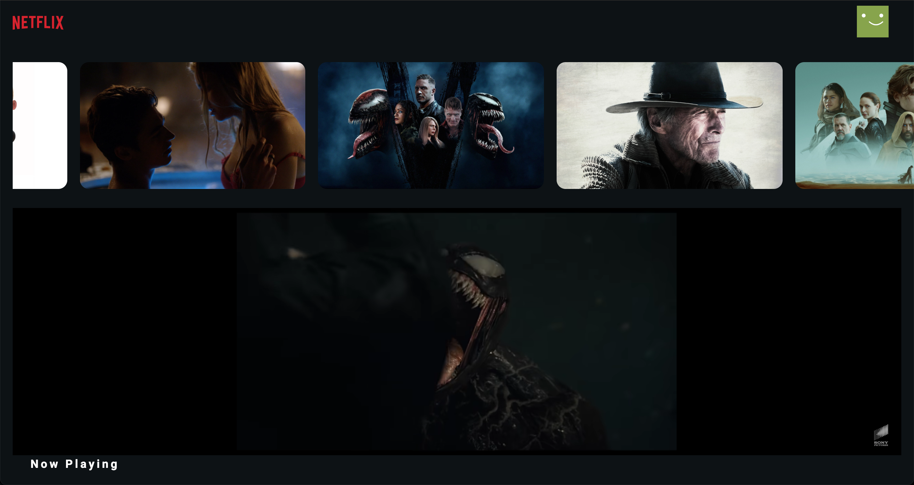

### Netflix-Clone :video_camera:

### API Used

[The Open Movie Database APIs](https://www.themoviedb.org/?language=ru)

[Cсылка на проект](netflix-clone-9f554.web.app/)

### API

- Method: `GET`
- URL Movie all: `https://api.themoviedb.org/3/trending/all/week?api_key=${API_KEY}&language=en-U`

### Libraries used

- `React Js { useState, useEffect }`
- `axios`
- `styled-compoents`
- `axios`
- `movie-trailer`
- `firebase`
- `react-youtube`
- `react-youtube`

### Фотографии проекта

#    
